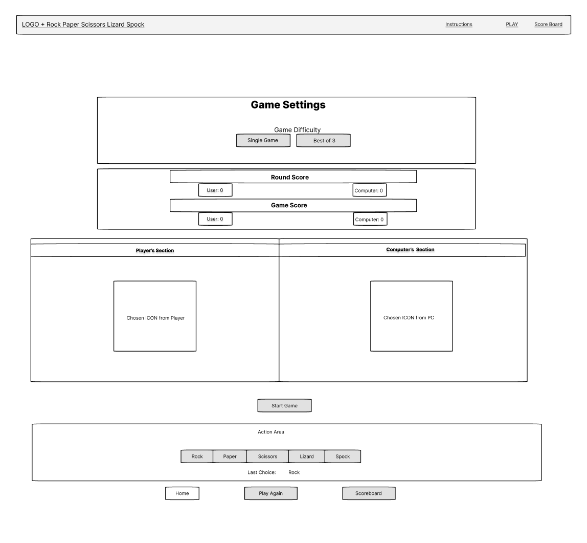
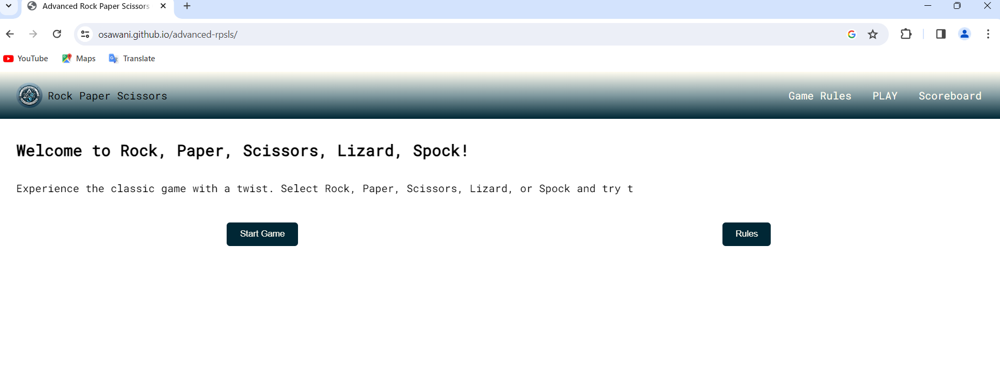
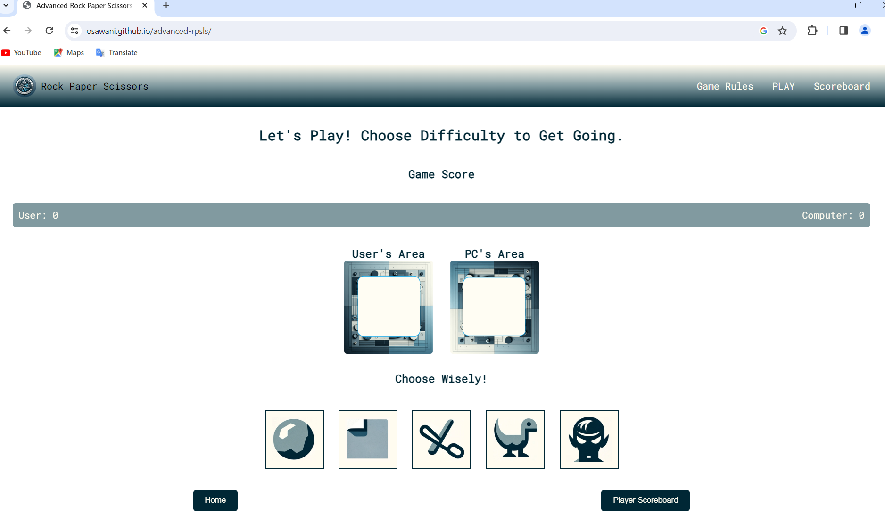
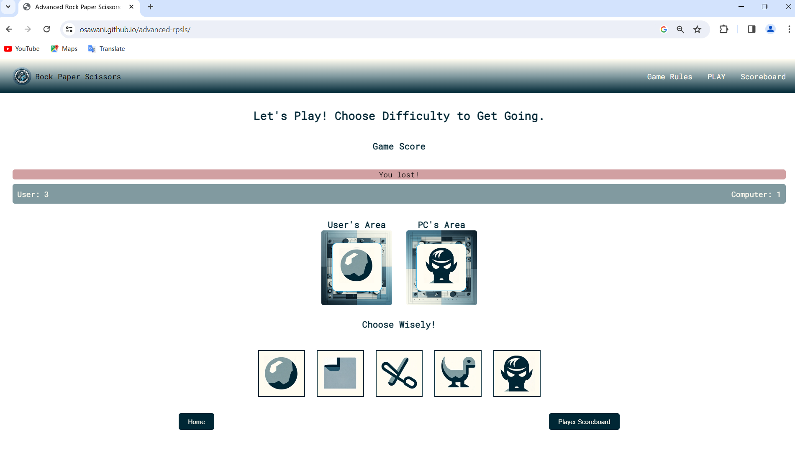
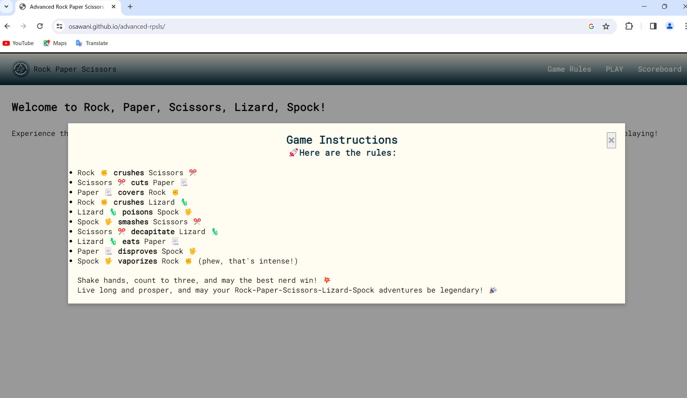
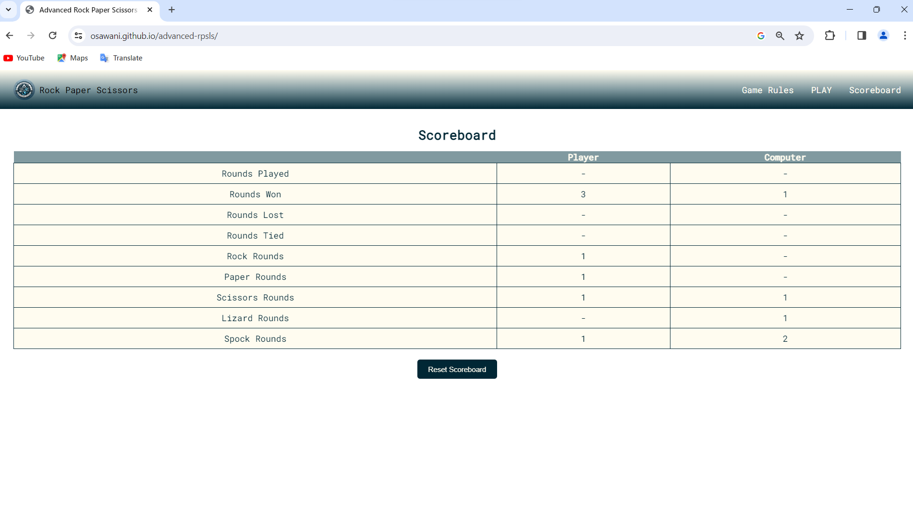
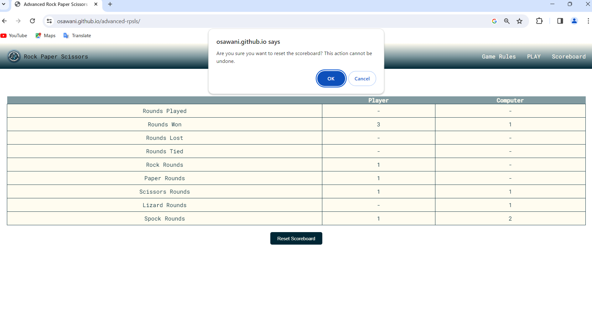
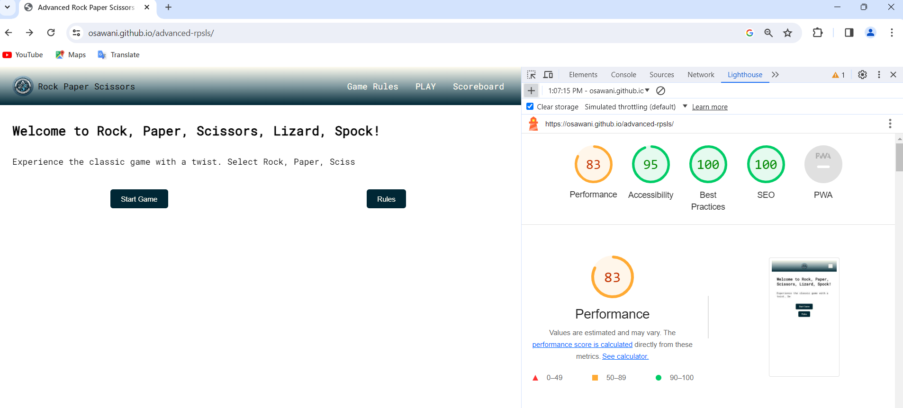

# 

# Rock, Paper, Scissors, Lizard, Spock Game

## Table of Contents

- ## Table of Contents
- [Introduction](#introduction)
- [The Five Planes of UX](#the-five-planes-of-ux)
  - [Strategy Plane](#strategy-plane)
  - [Scope Plane](#scope-plane)
  - [Structure Plane](#structure-plane)
  - [Skeleton Plane](#skeleton-plane)
  - [Surface Plane](#surface-plane)
- [Purpose](#purpose)
- [Value Proposition](#value-proposition)
- [Target Audience](#target-audience)
- [Key Features](#key-features)
- [Screenshots](#screenshots)
- [Deployment Procedure](#deployment-procedure)
- [Future Development](#future-development)
- [Bugs and Fixes](#bugs-and-fixes)
- [Lighthouse Report & Validator Results](#lighthouse-report--validator-results)
- [Credits](#credits)

## Introduction

Welcome to the repository for the Rock, Paper, Scissors, Lizard, Spock game, an interactive web application designed to provide a delightful and engaging gaming experience to users looking for an online strategy game that incorporates elements of luck and decision-making.

## The Five Planes of UX

### Strategy Plane

The core objective of this application is to entertain users with a strategy-based game that is both familiar and novel.

### Scope Plane

I established the requirements to includ real-time score tracking, and a scoreboard for user sessions. Content-wise, I focused on clear instructions, engaging feedback, and session-based progress tracking.

### Structure Plane

In this plane, I designed the interaction between the user and the application. It includes starting a new game, receiving instant feedback, and reviewing scores. Information architecture was  planned to ensure intuitive navigation and a logical flow of actions.

### Skeleton Plane

The interface, navigation, and information design were crafted to provide a seamless user experience. This involved creating a consistent layout, ensuring clear pathways for navigating through the game, and presenting game rules and scores in an understandable format. Figma was used to wireframe. 
Due to scope change referenced below in future development plans, i had to pivot from this and produce a simpler version of the wireframe to reduce complexity.

### Surface Plane

In the final plane, I brought visual aesthetics to the forefront. The design features a color scheme and AI generated images, playful graphics that complement the game's strategy theme. Responsive design principles ensure the application is usable across a variety of devices. The colour palette was chosen to be Muted grey, blue and white (# 809a9f # 012536 # fffcf1).

## Purpose

The primary purpose of this web application is to entertain users by providing a digital version of the classic game with added complexity through the inclusion of Lizard and Spock options. This is inspired by the Big Bang Theory’s version of the game. 

## Value Proposition

This game stands out by providing a familiar yet different gaming experience that is accessible to all users, regardless of device. It enhances cognitive skills by requiring players to remember and apply the expanded rules of this classic game.

## Target Audience

The game is targeted towards individuals who enjoy casual games and are looking for quick and entertaining play sessions. It's perfect for players of all ages seeking a fun challenge against a computer opponent.

## Key Features

### Real-Time Score Tracking

Scores are updated in real-time on the play screen, allowing you to track your progress and adjust your strategy accordingly.

### Session Scoreboard

A scoreboard that tracks your scores throughout your gaming session, providing a historical view of your game results.

### Play Against the Computer

Test your skills against a computer opponent that randomly selects its move, ensuring a fair game each time.

### Responsive Design

Enjoy the game on any device, thanks to a responsive design that adapts to desktop, and mobile screens.

## Screenshots

### Main Screen

*The main screen provides a warm welcome with a typewriting effect, game instructions, and the option to start playing.*

### Play Screen

*Here, you select your move and compete against the computer. This screen also displays the current score.Instructions popup is showcased here, it smoothly slides down with an animation to elicit a positive emotion*

### Scoreboard Screen

*The scoreboard shows your session's scores, enhancing the competitive aspect of the game.The user is warned before resetting hos records using an alert to avoid invalid or anintended input*

## Deployment Procedure

This web application is hosted using GitHub Pages, allowing for easy access and seamless updates. To play the game, follow the steps below:

1. Ensure you have an updated browser. As seen in jshint's report, if you have an old browser you might have issues. This application is best experienced on the latest versions of Chrome, Firefox, Safari, or Edge.
2. Visit the application's URL: [Rock, Paper, Scissors, Lizard, Spock Game](https://osawani.github.io/advanced-rpsls/)

No installation or setup is required. The game is fully playable from any compatible web browser.

## Future Development

I have considered the following features to be included in future iterations of the game:

### Functionality
- **Modes & Difficulty:** Game modes with varying difficulty (RPS and RPSLS), a limited number of tries (single and best of 3). This was part of the project scope but got dropped because of lack of knowledge when it comes to code modularisation. I attempted to do this as seen in my commit history but i failed. This aims to challenge players by offering different levels of difficulty and play modes.
- **Online Multiplayer:** Allow users to play against friends or random opponents over the internet.Use of sockets is here required which is beyond the skillset i have acquired so far.
- **Real-Time Game Rooms:** Implement a lobby system where players can join or create game rooms.

### User Experience & Progression
-**User Interface:** As documented in the bugs section of the README, i attempted to develop shuffling animations, animation sounds but i could not get it to work so this sits highly on my list.
- **User Registration:** Introduce account creation to save game progress, scores, and settings.
- **Achievements System:** Add achievements to reward players for reaching milestones or completing specific challenges.

## Bugs and Fixes

### Fixed Bugs

I have squashed many HTML & CSS bugs along the way, these can be seen in commit history and are not mention worthy. Instead I will focus on the real challenges i faced which i couldn't solve because of either lack of experience or insufficient skillset/knowledge-base.

- In navbar i struggeled toggling the different parts of the single page app on and off, i could not get this to work without using javvscript for navigation. To fix the css issues i was having i had to write JavaScript code that initializes navigation and modal functionality using an event listener document.addEventListener('DOMContentLoaded', function (event) {}) for a responsive navigation bar. It toggles the menu on button click, handles navigation to different screens or modals, and manages modal open/close events based on user interactions.
- Scoping of variables has broken my on multiple occasions, the most challenging of which was when i attempted to write modulrised JS code to improve readability and maintainability. This has proven to be too bigger task to handle given the modules i have studied so far. Big shout out to my mentor here for pointing me in the right-direction and sharing with me what using devtool in an advanced manner look like.
- I fixed the scoping issues i had by reverting back to a single JS file with global variables for DOM elements and local for function scope. 
- Initially, gameData was declared within a function, limiting its scope and preventing other functions from accessing the up-to-date game state. This caused issues with the scoreboard not reflecting current game data. By moving the declaration of gameData outside of any function, making it global, all parts of the code could access and modify this shared state. Consequently, functions responsible for updating the UI, like the scoreboard, now had the correct data to display. This change ensured consistency in the game's behavior and allowed the scoreboard to accurately represent the progress and results of the game across different rounds and sessions.
- Another Issue I had when i attempted modurising is "bubbling" I still do not understand this concept but my mentor has pointed this out to me while troubleshooting.

### Known Issues
It must be known that i set out working on this project with a more complex scope than the project ended to be. Some features were removed from my code base completely and acknowlege in the future iterations section of the readme. These include but not limited to game mode and game difficulty. 
- There are other parts which i left in the code because untill the last commit they were not behaving in a predictable manner.
- The shuffling animation i attempted implementing is one.
- The playing and shuffling sounds at the end of the round and while generating a computer choice are the others.

## Lighhouse Report & Validator Results

![JS jshint]
(./assets/images/project_screenshots/jshint.png)
(./assets/images/project_screenshots/jshint_2.png)
![HTML Validator]
(./assets/images/project_screenshots/CSS_validator.png)
![CSS Validator]
(./assets/images/project_screenshots/HTML_validator.png)

## Credits
Credits to my mentor, Medale Oluwafemi, for helping me salvage this project.
